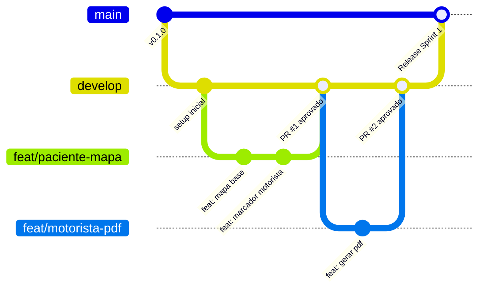

# 🤝 Guia de Contribuição e Padrões de Desenvolvimento

Este documento estabelece as diretrizes de versionamento, fluxo de trabalho e **padrão de commits** para a equipe de 4 desenvolvedores do projeto **TransSaúde**.

---

## 📌 1. Padrão de Commits (Conventional Commits)

Adotamos a especificação de **[Conventional Commits](https://www.conventionalcommits.org/)**. Todas as mensagens de commit devem ser claras, objetivas e padronizadas em português (ou inglês, se acordado pela equipe).

### 📐 Formato da Mensagem:

```text
<tipo>(<escopo opcional>): <descrição sucinta em minúsculas>

[corpo opcional explicando o motivo e o que foi feito]

[rodapé opcional com referências a issues, ex: Closes #12]
```

### 🏷️ Tipos Permitidos:

| Tipo | Descrição | Exemplo |
| :--- | :--- | :--- |
| `feat` | Uma nova funcionalidade adicionada ao sistema | `feat(motorista): adicionar geracao de relatorio pdf com assinatura` |
| `fix` | Correção de um bug ou comportamento inesperado | `fix(paciente): corrigir sincronizacao da localizacao em tempo real` |
| `docs` | Alterações em documentação (README, manuais, comentários) | `docs: atualizar diagrama de arquitetura no README` |
| `style` | Mudanças de formatação, lint, identação (sem alterar comportamento) | `style(admin): formatar telas conforme linter do dart` |
| `refactor`| Refatoração de código que não corrige bug nem adiciona funcionalidade | `refactor(auth): desacoplar servico de autenticacao do firebase` |
| `perf` | Mudança de código que melhora a performance/desempenho | `perf(maps): otimizar taxa de atualizacao do gps para economizar bateria` |
| `test` | Adição ou correção de testes unitários e de widgets | `test(relatorio): adicionar testes unitarios para calculo de adicional` |
| `chore` | Alteração em dependências, scripts de build ou configurações | `chore(deps): atualizar pacote flutter_pdf para versao mais recente` |

### 🎯 Escopos Sugeridos para o Projeto:
- `motorista`: Telas, regras e fluxos do motorista (baixas de ida/volta, rotas).
- `paciente`: Telas do paciente, localização do carro, botões de carona e consulta.
- `admin`: Painel administrativo, gestão de escalas, motoristas e pacientes.
- `auth`: Telas de login, cadastro, papéis de usuário (roles).
- `maps`: Integração com GPS, Google Maps ou OpenStreetMap e rotas.
- `relatorio`: Geração de PDFs, assinaturas e comprovantes de diárias.
- `firebase`: Configurações de Firestore, regras de segurança, Cloud Functions e Storage.

---

## 🌿 2. Estrutura de Branches (GitHub Flow Adaptado)

Para evitar conflitos entre os 4 desenvolvedores, **nunca faça commit direto nas branches principais (`main` e `develop`)**.



### Padrão de Nomenclatura de Branches:
- **Novas funcionalidades:** `feat/<modulo>-<breve-descricao>`  
  *Exemplo:* `feat/motorista-pdf-assinatura`, `feat/paciente-aviso-carona`
- **Correção de bugs:** `fix/<modulo>-<breve-descricao>`  
  *Exemplo:* `fix/firestore-baixa-duplicada`
- **Documentação / Infra:** `chore/<breve-descricao>` ou `docs/<breve-descricao>`  
  *Exemplo:* `chore/setup-firebase`, `docs/guia-ambiente`

---

## 🚀 3. Fluxo de Trabalho Passo a Passo para o Time

1. **Atualize sua base local antes de começar:**
   ```bash
   git checkout develop
   git pull origin develop
   ```

2. **Crie sua branch a partir da `develop`:**
   ```bash
   git checkout -b feat/motorista-lista-digital
   ```

3. **Desenvolva e faça commits pequenos e frequentes:**
   ```bash
   git add .
   git commit -m "feat(motorista): criar tela de lista de passageiros com checkbox de ida"
   ```

4. **Mantenha sua branch sincronizada:**
   ```bash
   git pull --rebase origin develop
   ```

5. **Envie sua branch para o GitHub:**
   ```bash
   git push origin feat/motorista-lista-digital
   ```

6. **Abra um Pull Request (PR):**
   - Direcionado para a branch `develop`.
   - Adicione uma descrição do que foi feito e capturas de tela se houver alteração de interface.
   - Solicite a revisão de **ao menos 1 colega de equipe**.
   - Após a aprovação e testes, faça o merge via `Squash and merge` ou `Rebase and merge`.

---

## 🛡️ 4. Boas Práticas do Time

- **Código Limpo:** Rode sempre `dart format .` e `flutter analyze` antes de commitar.
- **Não comitar segredos:** Nunca envie arquivos de chaves privadas ou tokens no Git.
- **Comunicação Ativa:** Antes de iniciar uma tarefa, avise o time no grupo para que duas pessoas não trabalhem no mesmo arquivo ou funcionalidade ao mesmo tempo.
