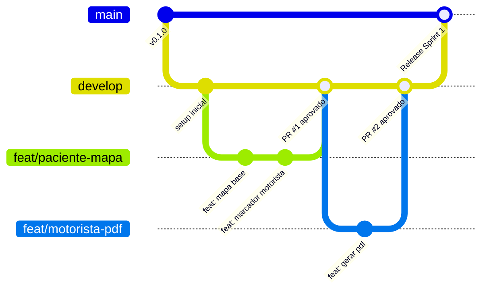

# 🤝 Guia de Contribuição e Padrões de Desenvolvimento

Este documento estabelece as diretrizes de versionamento, fluxo de trabalho e **padrão de commits** para a equipe de 4 desenvolvedores do projeto **TransSaúde**.

---

## 📌 1. Padrão de Commits (Conventional Commits)

Adotamos a especificação de **[Conventional Commits](https://www.conventionalcommits.org/)**. Todas as mensagens de commit devem ser claras, objetivas e padronizadas em português (ou inglês, se acordado pela equipe).

### 📐 Formato da Mensagem:

```text
<tipo>(<escopo opcional>): <descrição sucinta em minúsculas>

[corpo opcional explicando o motivo e o que foi feito]

[rodapé opcional com referências a issues, ex: Closes #12]
```

### 🏷️ Tipos Permitidos:

| Tipo | Descrição | Exemplo |
| :--- | :--- | :--- |
| `feat` | Uma nova funcionalidade adicionada ao sistema | `feat(motorista): adicionar geracao de relatorio pdf com assinatura` |
| `fix` | Correção de um bug ou comportamento inesperado | `fix(paciente): corrigir sincronizacao da localizacao em tempo real` |
| `docs` | Alterações em documentação (README, manuais, comentários) | `docs: atualizar diagrama de arquitetura no README` |
| `style` | Mudanças de formatação, lint, identação (sem alterar comportamento) | `style(admin): formatar telas conforme linter do dart` |
| `refactor`| Refatoração de código que não corrige bug nem adiciona funcionalidade | `refactor(auth): desacoplar servico de autenticacao do firebase` |
| `perf` | Mudança de código que melhora a performance/desempenho | `perf(maps): otimizar taxa de atualizacao do gps para economizar bateria` |
| `test` | Adição ou correção de testes unitários e de widgets | `test(relatorio): adicionar testes unitarios para calculo de adicional` |
| `chore` | Alteração em dependências, scripts de build ou configurações | `chore(deps): atualizar pacote flutter_pdf para versao mais recente` |

### 🎯 Escopos Sugeridos para o Projeto:
- `motorista`: Telas, regras e fluxos do motorista (baixas de ida/volta, rotas).
- `paciente`: Telas do paciente, localização do carro, botões de carona e consulta.
- `admin`: Painel administrativo, gestão de escalas, motoristas e pacientes.
- `auth`: Telas de login, cadastro, papéis de usuário (roles).
- `maps`: Integração com GPS, Google Maps ou OpenStreetMap e rotas.
- `relatorio`: Geração de PDFs, assinaturas e comprovantes de diárias.
- `firebase`: Configurações de Firestore, regras de segurança, Cloud Functions e Storage.

---

## 🌿 2. Estrutura de Branches (GitHub Flow Adaptado)

Para evitar conflitos entre os 4 desenvolvedores, **nunca faça commit direto nas branches principais (`main` e `develop`)**.



### Padrão de Nomenclatura de Branches:
- **Novas funcionalidades:** `feat/<modulo>-<breve-descricao>`  
  *Exemplo:* `feat/motorista-pdf-assinatura`, `feat/paciente-aviso-carona`
- **Correção de bugs:** `fix/<modulo>-<breve-descricao>`  
  *Exemplo:* `fix/firestore-baixa-duplicada`
- **Documentação / Infra:** `chore/<breve-descricao>` ou `docs/<breve-descricao>`  
  *Exemplo:* `chore/setup-firebase`, `docs/guia-ambiente`

---

## 🚀 3. Fluxo de Trabalho Passo a Passo para o Time

1. **Atualize sua base local antes de começar:**
   ```bash
   git checkout develop
   git pull origin develop
   ```

2. **Crie sua branch a partir da `develop`:**
   ```bash
   git checkout -b feat/motorista-lista-digital
   ```

3. **Desenvolva e faça commits pequenos e frequentes:**
   ```bash
   git add .
   git commit -m "feat(motorista): criar tela de lista de passageiros com checkbox de ida"
   ```

4. **Mantenha sua branch sincronizada:**
   ```bash
   git pull --rebase origin develop
   ```

5. **Envie sua branch para o GitHub:**
   ```bash
   git push origin feat/motorista-lista-digital
   ```

6. **Abra obrigatoriamente uma Pull Request (PR) no GitHub:**
   - ⚠️ **ATENÇÃO:** Nunca faça push ou merge direto para `develop` ou `main`. **Assim que terminar os commits e enviar sua branch com `git push`, acesse o repositório no GitHub e abra imediatamente uma Pull Request (PR).**
   - 🛑 **SÓ ABRA A PR SE TIVER ABSOLUTA CERTEZA DO QUE FEZ:** Não envie código quebrado, não testado ou feito pela metade. Rode o aplicativo localmente, teste todas as ações e execute `flutter analyze` para garantir que não há erros de compilação ou linter.
   - Configure a branch de destino como `develop` (base: `develop` <- compare: `sua-branch`).
   - Preencha um título e uma descrição clara explicando o que foi implementado/corrigido (inclua prints ou vídeos se alterou telas).
   - 🗑️ **STATUS DA BRANCH (OBRIGATÓRIO INFORMAR NA PR):** Deixe expressamente claro na descrição da PR se a sua branch deve ser **deletada após o merge** ou se **você ainda vai continuar usando ela**.
     * Adicione essa caixa de seleção na descrição do PR:
       - `[X] Deletar branch após o merge` (se a feature foi concluída)
       - `[ ] Manter branch ativa (ainda continuarei usando para próximas tarefas)`
   - Solicite a revisão (*Reviewers*) de **ao menos 1 colega de equipe**.
   - O merge só pode ser feito após a aprovação e validação dos testes.

---

## 🔀 4. Padrão para o Nome do Commit de Merge do PR

Ao aprovar e realizar o merge da PR no GitHub, o commit de merge deve seguir obrigatoriamente um formato padronizado para manter o histórico do Git limpo e rastreável.

### 📐 Formato Padrão:

```text
merge(<escopo>): <descrição sucinta da entrega em minúsculas> (PR #<número>)
```

> **Nota:** Se você utilizar o botão de merge nativo do GitHub, edite a primeira linha do commit para seguir esse padrão.

### 💡 Exemplos:
* `merge(paciente): integrar painel e status de transporte (PR #2)`
* `merge(motorista): adicionar lista de passageiros e baixa de ida (PR #3)`
* `merge(auth): tela de login e fluxo de autenticacao firebase (PR #4)`
* `merge(admin): implementar gestao de viagens diarias (PR #5)`
* `merge(fix/paciente): corrigir confirmacao de carona no dialogo (PR #6)`

---

## 🚀 5. Como Enviar para a `main` (Produção / Release Oficial)

A branch `main` reflete exclusivamente o código em **produção / versão estável para entrega**. **Nenhum desenvolvedor cria branch nem abre PR individual direto para a `main`.**

### 📦 Fluxo de Fechamento de Versão:
1. Durante a sprint, todas as branches (`feat/...`, `fix/...`) são mergeadas na **`develop`** via PR.
2. Quando todas as telas e regras estiverem integradas e testadas na `develop`, abre-se a **Pull Request de Release**:
   * **Base:** `main` $\leftarrow$ **Compare:** `develop`
   * **Título da PR:** `release: versão final da sprint X` (ou `Release v1.0.0`)
   * **Padrão de commit do merge:** `release(sprint-1): consolidacao das entregas (v1.0.0)`
3. Com o PR aprovado e mergeado, a `main` estará atualizada com a versão oficial de produção.

---

## 🛡️ 6. Boas Práticas e Regras Inegociáveis do Time

> [!CAUTION]
> ### 🛑 NUNCA DÊ PUSH DIRETO NA `develop` OU NA `main`!
> Se você der `git push origin develop` ou `git push origin main` direto sem abrir PR, **você é uma anta e vai quebrar o código de todo mundo.**
> * Todo e qualquer código entra **EXCLUSIVAMENTE via Pull Request**.
> * Não existe "foi só uma linha rápida" ou "era só um errinho". Crie uma branch, commite nela e abra PR.
> * Quem empurrar commit direto na `develop` vai pagar o lanche do grupo inteiro e resolver conflito de merge linha por linha no braço.

- **Código Limpo:** Rode sempre `dart format .` e `flutter analyze` antes de commitar.
- **Não comitar segredos:** Nunca envie arquivos de chaves privadas ou tokens no Git.
- **Comunicação Ativa:** Antes de iniciar uma tarefa, avise o time no grupo para que duas pessoas não trabalhem no mesmo arquivo ou funcionalidade ao mesmo tempo.

